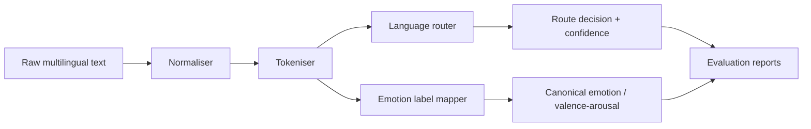

# Low-Resource NLP Toolkit

A public, research-facing Python toolkit for African language pre-processing, emotion-label mapping, evaluation, and language/dialect routing.

The project is designed as a safe open-source wrapper around the kinds of NLP engineering problems that appear in low-resource and multilingual AI research: noisy text, code-switching, uneven label taxonomies, small datasets, and evaluation that must be transparent.

Status: `0.1.0` seed release from source. Local checks, CI, isolated wheel builds, metadata checks, and install tests pass.

## Why This Exists

Low-resource NLP projects often spend too much time rebuilding the same foundations before modelling begins. This toolkit provides a dependable base layer:

- Text normalisation for noisy social, conversational, and cultural text.
- Lightweight African language routing for Yoruba, Igbo, Hausa, Nigerian Pidgin, Swahili, and English.
- Emotion label harmonisation across categorical and valence-arousal formats.
- Evaluation utilities for classification and routing experiments.
- A CLI and examples that run without downloading model weights.
- Extension points for transformer or embedding backends when a project needs heavier models.

## Architecture



## Quick Start

```bash
python3 -m venv .venv
source .venv/bin/activate
python -m pip install -e .
low-resource-nlp --version
```

Route a text sample:

```bash
low-resource-nlp route "abeg make una help me check this model output"
```

Normalise text:

```bash
low-resource-nlp normalise "Ẹ káàrọ̀!!! Visit https://example.com @user"
```

Map an emotion label:

```bash
low-resource-nlp label joy
```

Run tests:

```bash
make check
```

Without `make`:

```bash
python3 scripts/quality_gate.py
PYTHONPATH=src python3 -m unittest discover -s tests
```

## Python Usage

```python
from low_resource_nlp import LexicalLanguageRouter, normalise_text, label_to_valence_arousal

text = normalise_text("Ẹ káàrọ̀, báwo ni?")
decision = LexicalLanguageRouter.default().route(text)
emotion = label_to_valence_arousal("joy")

print(decision.language_code, decision.confidence)
print(emotion)
```

## Current Scope

The first public release deliberately avoids bundling private datasets or model weights. The core is deterministic, inspectable, and dependency-light. Optional embedding and transformer backends are outside the current core package.

Supported core modules:

- `normalisation`: Unicode-aware text cleaning, URL/user normalisation, tokenisation, repeated-character handling.
- `routing`: script-aware and lexicon-assisted language routing.
- `labels`: canonical emotion labels and valence-arousal mapping.
- `evaluation`: precision, recall, F1, macro/micro summaries, and confusion matrices.
- `datasets`: simple CSV/JSONL readers for experiment scaffolding.

## Public Project Materials

- [Changelog](https://github.com/oyinkanchekwas/low-resource-nlp-toolkit/blob/main/CHANGELOG.md)
- [Contributing guide](https://github.com/oyinkanchekwas/low-resource-nlp-toolkit/blob/main/CONTRIBUTING.md)
- [Documentation index](https://github.com/oyinkanchekwas/low-resource-nlp-toolkit/blob/main/docs/index.md)
- [0.1.0 release plan](https://github.com/oyinkanchekwas/low-resource-nlp-toolkit/blob/main/docs/release_plan_v0_1.md)
- [Adoption notes](https://github.com/oyinkanchekwas/low-resource-nlp-toolkit/blob/main/docs/adoption.md)
- [Model card template](https://github.com/oyinkanchekwas/low-resource-nlp-toolkit/blob/main/docs/model_card_template.md)
- [Data statement template](https://github.com/oyinkanchekwas/low-resource-nlp-toolkit/blob/main/docs/data_statement_template.md)
- [Citation metadata](https://github.com/oyinkanchekwas/low-resource-nlp-toolkit/blob/main/CITATION.cff)

## Responsible AI Notes

This toolkit is for research and prototyping. Language, dialect, and emotion labels are socially and culturally sensitive. Do not treat routing or emotion predictions as identity labels, clinical assessments, or ground truth. Always evaluate with speakers, domain experts, and context-specific data.

## External Use

External use signals should be public and verifiable: issues from real users, pull requests, tutorial use, workshop demos, citations, package downloads, or adoption by a lab/community project. Self-generated activity should not be counted as impact.
